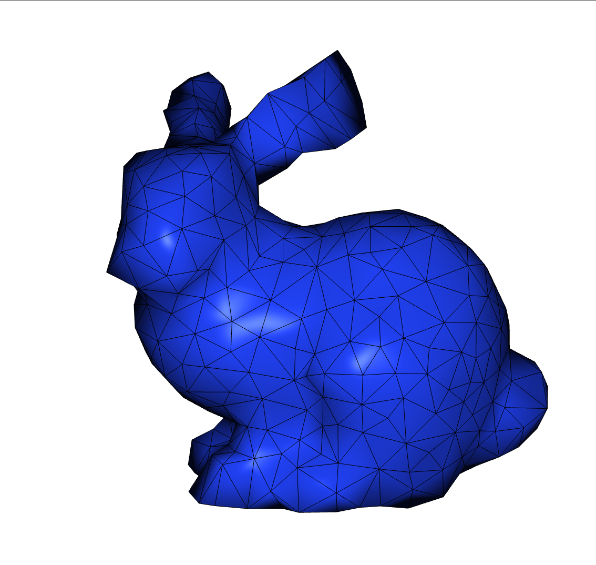

# SimulationStarterKit

This repository contains a basic physics-based simulation with a visualization window, providing a starting point for exploring and developing physics-based simulations.



## build

```shell
git clone git@github.com:liumu96/SimulationStarterKit.git
cd SimulationStarteKit
mkdir build && cd build
cmake .. && make
./simulation_starter_kit
```

## Acknowledgement

This starterkis is based on [assignment](https://github.com/dilevin/CSC417-a3-finite-elements-3d) from Prof. David I.W. Levin.
